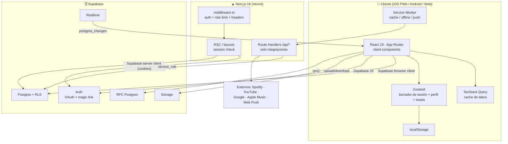
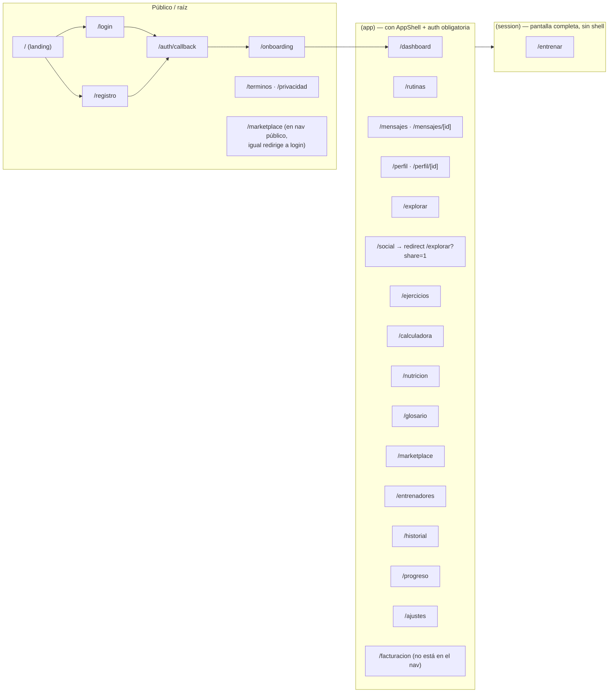
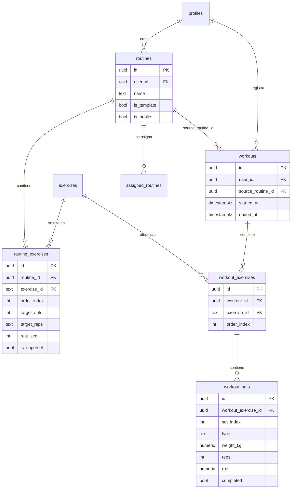
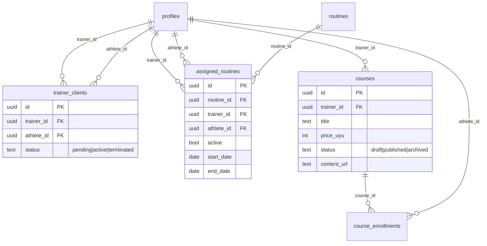
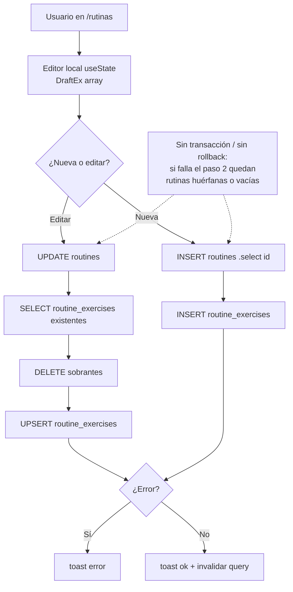
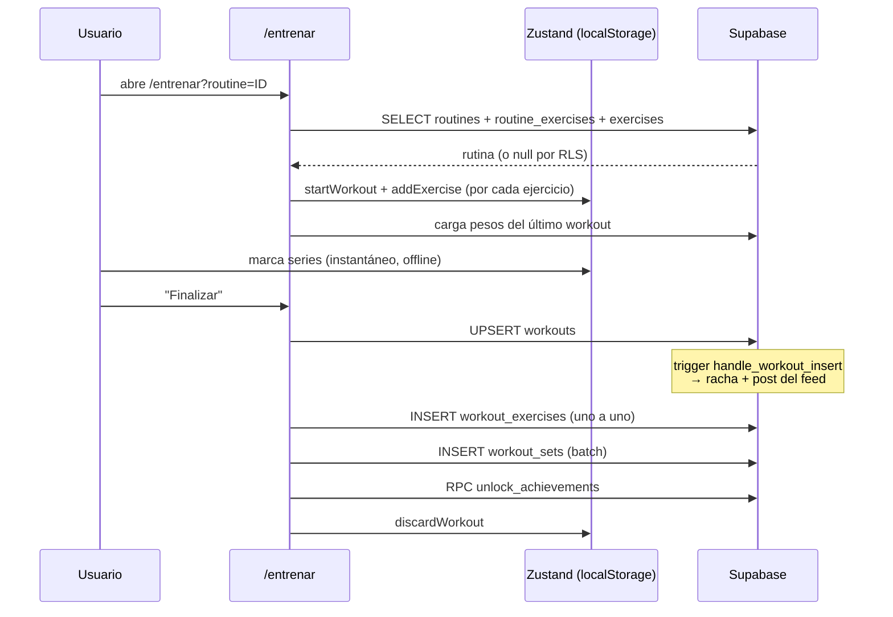
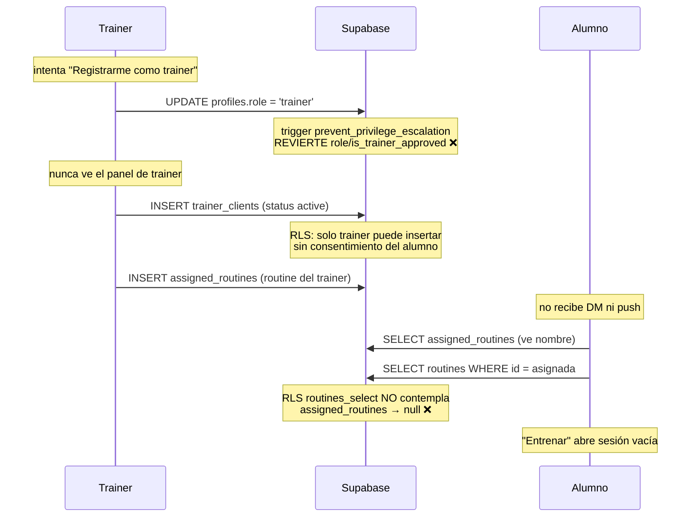

# Mapa visual de Hipertrof.ia

> Documento maestro. Explica **qué partes tiene la app**, **cómo se comunican**
> y **qué protocolos usa cada una**. Los diagramas son Mermaid (se ven en
> GitHub). Última auditoría de código: ver [`06-diagnostico-rutinas-y-trainer.md`](./06-diagnostico-rutinas-y-trainer.md).

> ⚠️ **Ojo**: `docs/architecture/01-vision-general.md`, `02-modelo-datos.md`,
> `docs/02-arquitectura.md` y `docs/07-mapa-completo-web.md` están
> **desactualizados**: describen Prisma + SQLite + FSD, que **no existen** en el
> código. El stack real es el de este documento.

---

## 1. Qué es y qué partes tiene

PWA **web-first** (instalable en iOS/Android, wrapper Capacitor) para **atletas**
y **personal trainers**. Tres grandes bloques:

| Bloque | Módulos | Qué hace |
|---|---|---|
| **Entrenamiento** | `rutinas`, `entrenar`, `ejercicios`, `historial`, `progreso`, `calculadora`, `glosario` | Crear rutinas, ejecutar sesiones (diario de cargas), ver récords y progreso |
| **Trainer** | `entrenadores`, `marketplace`, `facturacion`, `mensajes` | Vinculación trainer↔alumno, asignar rutinas/recetas, cursos, suscripciones |
| **Social / vida** | `dashboard`, `explorar`, `perfil`, `social`, `nutricion`, `mensajes`, `ajustes` | Feed, seguir usuarios, recetas, chat, integración musical |

---

## 2. Vista de sistema (alto nivel)



**Regla de oro:** el **90% de los datos** viaja directo del navegador a Supabase
(con RLS como control de acceso). Next.js **no** es una API REST de dominio:
solo hace SSR de layouts/auth y expone `/api/*` para integraciones externas.

---

## 3. Stack real

| Capa | Tecnología | Dónde |
|---|---|---|
| Framework | Next.js **16.3.1** (App Router, RSC) | `web/next.config.ts` |
| UI | React 19.0.2, Tailwind CSS v4, lucide-react | `web/src/**` |
| Backend / DB | **Supabase** (Postgres + RLS + Auth + Realtime + Storage) | `web/src/lib/supabase/**` |
| Estado cliente | Zustand 5 (persist) + TanStack Query 5 | `web/src/lib/workout-store.ts`, `web/src/components/providers.tsx` |
| Integraciones | Spotify OAuth PKCE, YouTube oEmbed, Web Push | `web/src/app/api/**` |
| Mobile | Capacitor 8.5 (iOS/Android shell) | `web/capacitor.config.ts` |
| Deploy | Vercel | `web/.vercel` |

> **No hay** Prisma, SQLite, `server actions`, ni capas FSD. Ignorar `dev.db`,
> `web-legacy/` y los docs viejos.

---

## 4. Mapa de rutas (App Router)



Nav del shell: `web/src/components/app-shell.tsx` (bottom tab bar móvil +
sidebar desktop + sheet "Más"). `PRIMARY` = dashboard, rutinas, mensajes, perfil.

---

## 5. Estructura real de carpetas

```text
web/
├── src/
│   ├── app/
│   │   ├── (app)/          # producto (auth + AppShell)
│   │   ├── (auth)/         # login / registro
│   │   ├── (session)/      # entrenar (pantalla completa)
│   │   ├── auth/callback/  # intercambio de código Supabase
│   │   ├── onboarding/     # alta guiada (server)
│   │   ├── api/            # route handlers SOLO de integraciones
│   │   ├── layout.tsx      # metadata + Providers
│   │   ├── manifest.ts     # PWA manifest (/manifest.webmanifest)
│   │   └── globals.css     # tokens, dark mode, safe-areas iOS
│   ├── components/         # app-shell, ui/, providers, toggles…
│   └── lib/                # supabase/, stores, planes, glosario
├── public/sw.js            # service worker
├── supabase/migrations/    # 15 migraciones SQL (fuente de verdad del modelo)
└── android/ · capacitor.config.ts
```

---

## 6. Modelo de datos (tablas reales)

Las 23 tablas creadas por las migraciones. Detalle de Drift al final.

### 6.1 Núcleo entrenamiento



### 6.2 Relación trainer ↔ alumno



### 6.3 Social / vida (resumen)

`followers` (N–M perfiles, `is_best_friend`), `feed_posts` (`workout`/`achievement`/`status`/`routine`/`recipe`, con `scope`), `post_likes`, `post_comments`,
`achievements` → `user_achievements`, `recipes` → `meal_logs`, `daily_entries`,
`user_connections` (Spotify/Apple/YouTube) → `playlists`, `message_reactions`.

### 6.4 🔴 Drift: lo que el código usa pero **ninguna migración crea**

| Objeto | Tipo | Usado por | Estado |
|---|---|---|---|
| `assigned_recipes` | tabla | `entrenadores`, `nutricion` | ❌ no existe → recetas asignadas rotas |
| `direct_messages` | tabla | `mensajes`, `dm-notifications`, `entrenadores` | ❌ no se `create` (solo `alter`) → `db reset` falla en migración 13 |
| `push_subscriptions` | tabla | `api/push/register`, `api/push/send` | ❌ no existe → push nunca persiste |
| `spotify_tokens` | tabla | `api/spotify/*`, `lib/spotify-token` | ❌ no existe en migraciones |
| `star_balances` | tabla | `mensajes/[id]` | ❌ no existe |
| `get_conversations` | RPC | `app-shell`, `mensajes` | ❌ no existe → badge 0 |
| `send_message` | RPC | `mensajes/[id]` | ❌ no existe |
| bucket `dm-images` | storage | `mensajes/[id]` | ❌ no se crea |
| columnas `is_verified`, `instagram_handle`, `tiktok_handle`, `twitter_handle`, `spotify_handle`, `profile_track_*` | columnas | `perfil`, `perfil/[id]` | ❌ no migradas |

> Consecuencia clave: **la base de producción seguramente tiene estos objetos
> creados a mano** (por eso la app anda a medias), pero **una base nueva creada
> desde el repo no funciona**. Es deuda de reproducibilidad + una parte real de
> los bugs.

---

## 7. Protocolos / canales de comunicación

| Canal | Implementación | Cuándo se usa |
|---|---|---|
| **Supabase browser client** | `createBrowserClient` (`lib/supabase/client.ts`) | CRUD de dominio desde componentes `"use client"`: rutinas, workouts, social, nutrición, chat |
| **Supabase server client** | `createServerClient` + cookies (`lib/supabase/server.ts`) | SSR: layouts `(app)`/`(session)`, callback, landing |
| **RPC Postgres** | `supabase.rpc(...)` | `unlock_achievements`, `export_my_data`, `delete_account`, `get_conversations`, `send_message` |
| **Realtime** | `postgres_changes` | Chat (DM), reacciones, comentarios del feed |
| **Storage** | `supabase.storage.from(...)` | `avatars`, `banners`, `recipe-photos`, `dm-images` |
| **Route handlers** | `web/src/app/api/**` | **solo** integraciones: Spotify, YouTube, oEmbed, Push |
| **Web Push** | `web-push` + service worker | notificaciones (hoy incompleto) |

Detalle por dominio:

| Dominio | Canal | Archivo representativo |
|---|---|---|
| Rutinas | browser client → `routines`/`routine_exercises` | `(app)/rutinas/page.tsx` |
| Workouts | Zustand local → Supabase al finalizar | `(session)/entrenar/page.tsx` |
| Chat | browser + RPC `send_message` + Realtime | `(app)/mensajes/[id]/page.tsx` |
| Social | browser + Realtime | `(app)/explorar/page.tsx` |
| Trainer | browser → `trainer_clients`/`assigned_routines` | `(app)/entrenadores/page.tsx` |
| Spotify | route handlers server | `api/spotify/**` |
| YouTube | oEmbed (server) | `api/oembed/route.ts` |

**No hay server actions.** `rg "use server"` → 0.

---

## 8. Motor de rutinas — flujo real

### 8.1 Crear / editar rutina



- Estado del borrador: `useState` **local** (no Zustand).
- Guardado multi-paso **sin transacción** → riesgo de pérdida/duplicación de
  ejercicios. Detalle en el diagnóstico.

### 8.2 Iniciar y finalizar entrenamiento



> Puntos débiles: inserción de hijos **después** del trigger de racha/feed, y
> **sin transacción** → reintentos duplican series. Ver diagnóstico.

---

## 9. Flujo trainer ↔ alumno (estado actual)



Estados y capacidades **reales**:

| Acción | Trainer | Alumno |
|---|---|---|
| Autoregistrarse como trainer | ❌ bloqueado por trigger | — |
| Solicitar ser alumno | — | ❌ no existe |
| Aceptar / rechazar | ❌ UI sin origen de `pending` | ❌ no existe |
| Agregar alumno | ✅ unilateral, sin aviso | — |
| Dejar al trainer | — | ❌ no existe |
| Ver rutina asignada | ✅ | ⚠️ solo lista, **no abre** (RLS) |
| Ver progreso del alumno | ⚠️ solo `streak_count` | — |

---

## 10. Autenticación y sesión

```mermaid
flowchart TD
  A[Usuario] --> B{Proveedor}
  B -->|Google OAuth| C[signInWithOAuth]
  B -->|Magic link| D[signInWithOtp]
  B -->|Email+pass| E[signUp / signInWithPassword]
  C --> F[/auth/callback<br/>exchangeCodeForSession]
  D --> F
  F --> G{profiles.onboarded?}
  G -->|No| H[/onboarding]
  G -->|Sí| I[destino / next]
  I --> J[(app)/layout: getUser]
  J -->|sin sesión| K[/login?next=]
  J -->|ok| L[AppShell + ProfileProvider]
```

- `middleware.ts`: refresca token, headers de seguridad, rate-limit 60 req/min/IP,
  redirige a `/login`.
- `(app)/layout.tsx`: exige sesión y `onboarded=true`.
- ⚠️ `/auth/callback` **no** está en `PUBLIC_PATHS` → el primer request sin cookie
  puede redirigir a `/login` antes de ejecutar el handler.

---

## 11. Estado global (cliente)

| Store | Archivo | Persiste | Qué guarda |
|---|---|---|---|
| Workout draft | `lib/workout-store.ts` | ✅ localStorage (`hypertrofia-workout-draft`) | borrador de la sesión activa |
| Perfil | `components/providers.tsx` | ❌ | perfil del usuario (Zustand) |
| Toasts | `components/ui/toast.tsx` | ❌ | notificaciones |
| Query cache | `components/providers.tsx` | ❌ | TanStack Query (staleTime 30s) |
| Tema | `next-themes` | ✅ | claro/oscuro/sistema |

> ⚠️ **Dos** cargadores de perfil compiten: `ProfileSync` (en `providers.tsx`) y
> `ProfileProvider` (en los layouts). El primero pisa al segundo con un `select`
> incompleto → pierde `role`, `plan`, `is_admin`, `is_trainer_approved`.

---

## 12. PWA / offline / push

| Pieza | Archivo | Estrategia |
|---|---|---|
| Manifest | `src/app/manifest.ts` → `/manifest.webmanifest` | standalone, `start_url=/dashboard` |
| Service Worker | `public/sw.js` | `network-first` para Supabase y navegación (fallback shell), `cache-first` para estáticos |
| Registro SW | `components/sw-register.tsx` | solo en producción |
| Push (cliente) | `(app)/mensajes/page.tsx` | `pushManager.subscribe` con `NEXT_PUBLIC_VAPID_PUBLIC_KEY` |
| Push (server) | `api/push/send/route.ts` | protegido por `x-hook-secret`, **sin caller** en el repo |
| Detector offline | — | ❌ no existe (no hay banner de `navigator.onLine`) |

---

## 13. Integraciones externas

| Integración | Cómo | Auth |
|---|---|---|
| **Spotify** | `/api/spotify/auth` (PKCE) → `/callback` → tokens; `/data`, `/search`, `/share` | OAuth usuario + client_credentials |
| **YouTube** | `/api/oembed` (oEmbed, usado en perfil) | ninguna |
| **Apple Music** | `/api/oembed` | ninguna |
| **YouTube Data API** | `/api/youtube/search` | **huérfano** (sin usos, sin API key) |
| **Spotify debug** | `/api/spotify/debug` | ⚠️ **sin auth**, expone prefijo del Client ID |
| **Web Push** | `/api/push/*` + `web-push` | VAPID + hook secret |

---

## 14. Semáforo de salud

| Área | Estado | Comentario |
|---|---|---|
| Auth / login | 🟡 | callback posiblemente bloqueado por middleware |
| Rutinas propias (crear/editar) | 🟡 | funciona, pero sin transacción (pierde/duplica) |
| Rutinas asignadas (alumno) | 🔴 | RLS impide abrirlas |
| Rol trainer | 🔴 | trigger revierte + perfil no carga `role` |
| Recetas asignadas | 🔴 | tabla inexistente |
| Chat / DM | 🔴 | tabla/RPC inexistentes (salvo que existan a mano) |
| Push | 🔴 | sin caller + tabla inexistente |
| Cursos / marketplace | 🟠 | sin pago real ni acceso a contenido |
| Social / feed | 🟢 | funcional |
| PWA / tema / iOS | 🟢 | optimizado recientemente |

➡️ Diagnóstico detallado, causa raíz y plan de arreglo:
[`06-diagnostico-rutinas-y-trainer.md`](./06-diagnostico-rutinas-y-trainer.md)
